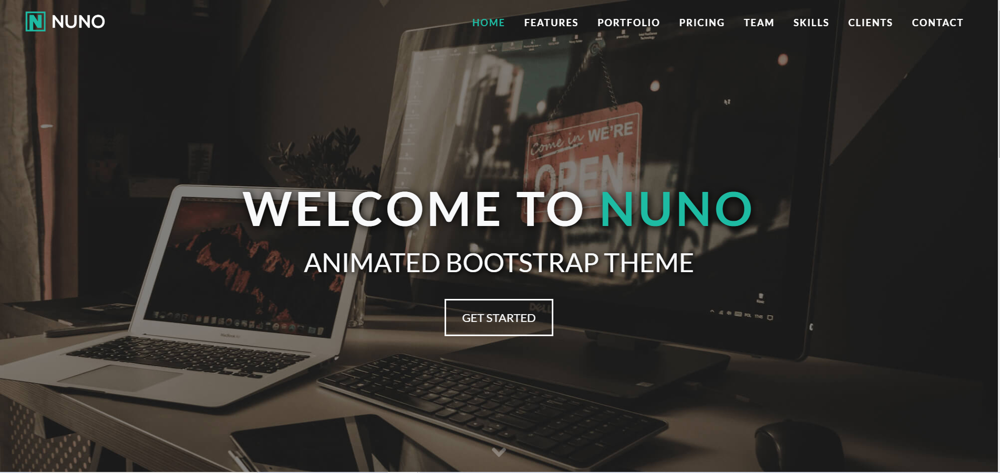

# advancedBootstrap

Este tema foi criado usado:  
HTML 5;  
CSS 3;  
Bootstrap 4;  
jQuery 3;  
Animações com Animate.css e Waypoints.js;  
Fontawesome 5;  
Owl.Carousel.js;  

## O tema

## Executando
Como é uma página estática, não há necessidade de HTTP Server, porém caso se queira rodar usando algum AddOn, indico dois:

### GoLive

Extensão do VS Code que roda em: http://127.0.0.1:5500/index.html

### Browser-sync

#### Instalação:

npm install -g browser-sync

### Comando:

browser-sync start --server --files "_.html" "assets/css/_.css"
